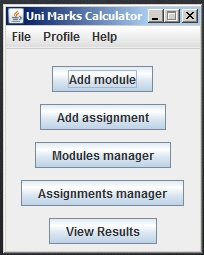
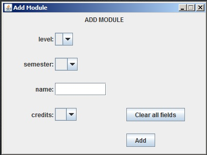
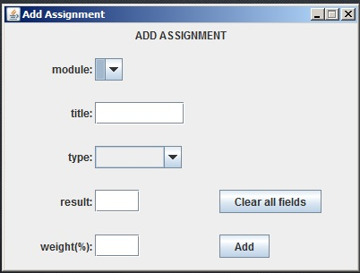
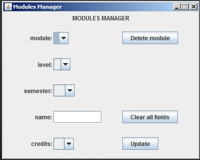
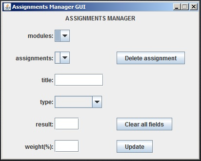
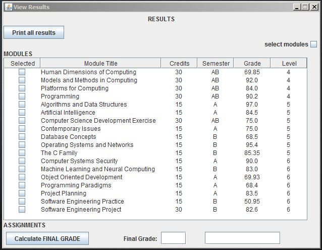
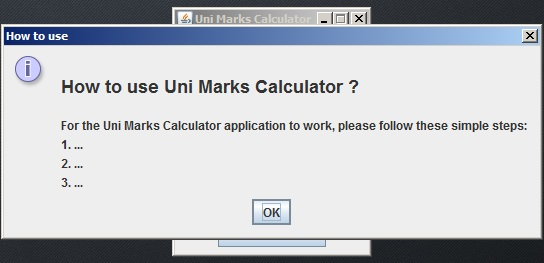
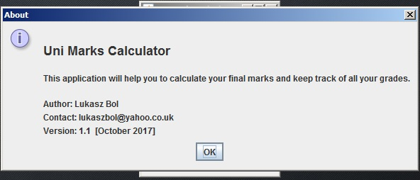
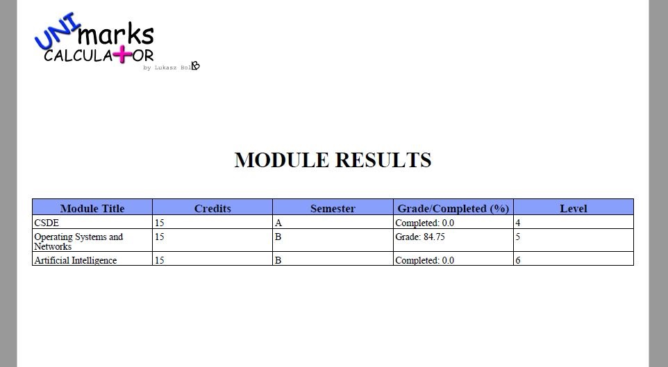

# UniMarksCalculator

## Contents

1. Project Description
2. System Look
3. The Repository
4. Future Development
5. Help

## 1. Project Description  
This program helps to calculate student's marks. It also shows how far the student is from their goal (1st, 2nd).

NOTE: The project is under construction.

## 2. System look
The below are screenshots from the initial version of the program:

## 2.1 Application start

## 2.2 Add module

## 2.3 Add assignment

## 2.4 Modules manager

## 2.5 Assignments manager

## 2.6 View results

## 2.7 Help Menu --> How_to_use

## 2.8 Help Menu --> About

## 2.9 Example of a PDF file created using 'Print' button and choosing 'Modules' option

## 2.10  Example of a PDF file created using 'Print' button and choosing 'Modules with Assignments' option

## 3. The Repository  
The repository consists of:
- JUnit - JUnit 4.12 and Hamcrest 1.3 libraries for conducting JUnit tests
- UniMarksCalculator - including program and JUnit tests
- systemPictures - pictures of the application's initial version

## 4. Future Development 
Future development of this application may include:
- a user profile
- remote database to store users' data
- information on how close the user (student) is from its goal (e.g. how many points do they need to get First-Class Honours degree)

## 5. Help  
Please do not hesitate to contact me on the below e-mail if you encounter any problems or need further information.
Contact: <b>lukaszbol[at]yahoo[dot]co[dot]uk</b>
