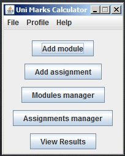
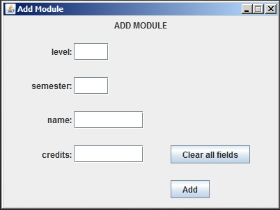
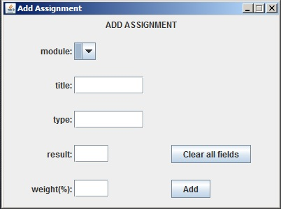
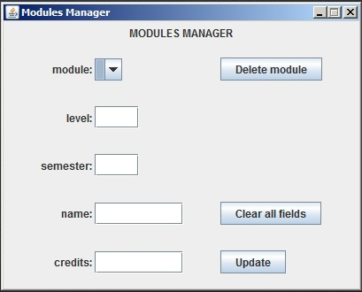
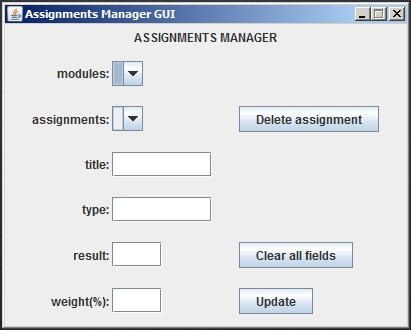
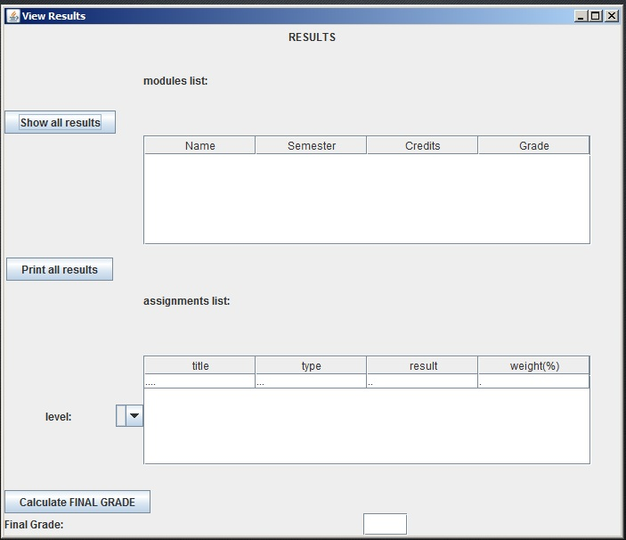
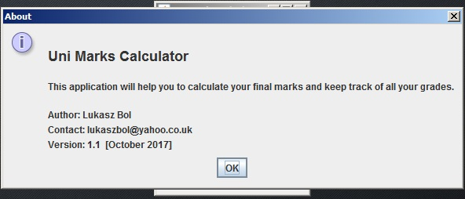

# UniMarksCalculator
This program helps to calculate student's marks. It also shows how far the student is from their goal (1st, 2nd).
NOTE: The project is under construction.

The below are screenshots from the initial version of the program:

## 1. Application start

## 2. Add module

## 3. Add assignment

## 4. Modules manager

## 5. Assignments manager

## 6.View results

## 7. Help Menu --> How_to_use

## 8. Help Menu --> About

